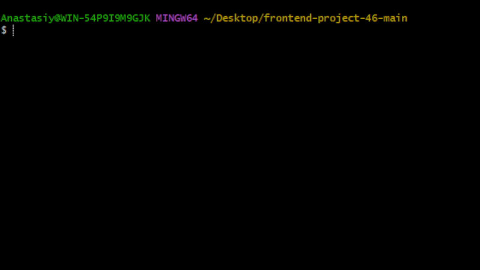
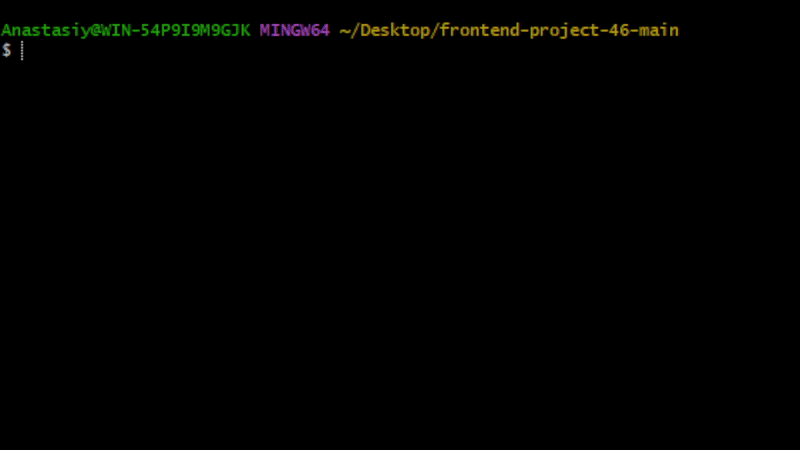

### Hexlet tests and linter status:
[](https://github.com/Sarsela/frontend-project-46/actions/workflows/hexlet-check.yml)
[](https://github.com/Sarsela/frontend-project-46/actions/workflows/ci.yml)
[](https://sonarcloud.io/summary/new_code?id=Sarsela_frontend-project-46)
[](https://sonarcloud.io/summary/new_code?id=Sarsela_frontend-project-46)
## Установка

```bash
# Клонируйте репозиторий
git clone ссылка на репозиторий
cd frontend-project-46

# Установите зависимости
npm install

# Установите пакет локально (для  тестирования)
npm link
```
## Использование

После установки команда `gendiff` будет доступна в терминале:

```bash
# Вывести справку
gendiff -h

# Показать версию
gendiff -V

# Сравнить два JSON файла
make test-json

# Сравнить с форматом plain
make test-json-plain

# Сравнить с форматом json
make test-json-json

# Сравнить YAML файлы
make test-yaml

# Сравнить YAML с форматом plain
make test-yaml-plain

# Сравнить файлы разных форматов
gendiff __fixtures__/file1.json __fixtures__/file2.yaml
```

# Демонстрация
## Справка

## Версия

## Сравнение два JSON файла

## Сравнение с форматом plain

## Сравнение с форматом json

## Сравнение YAML файлы

## Сравнение YAML с форматом plain

## Сравнение файлы разных форматов

